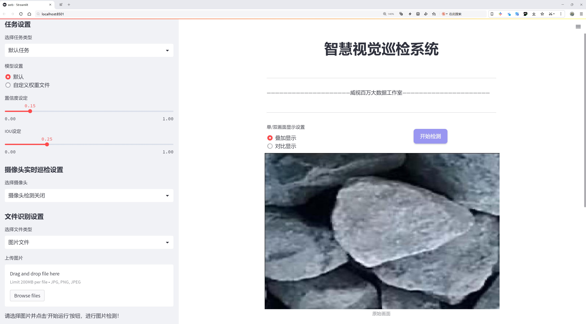
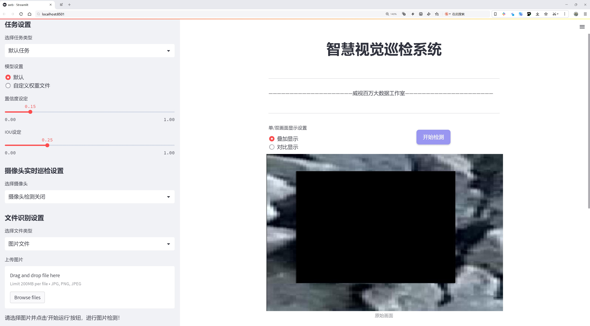
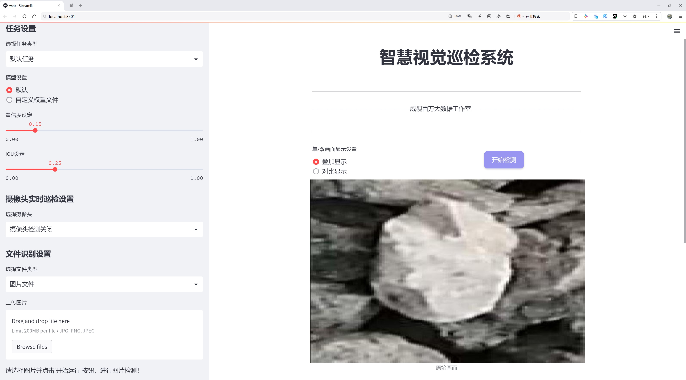
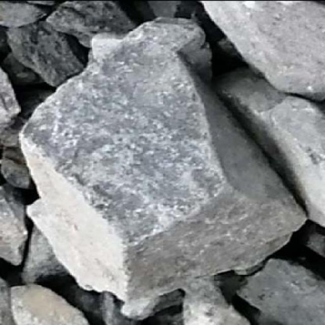
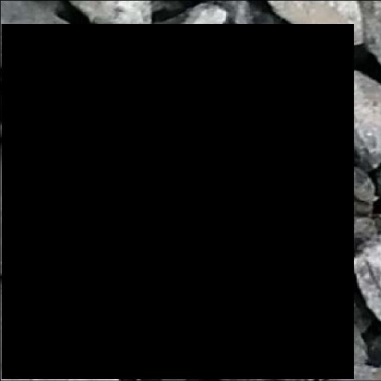
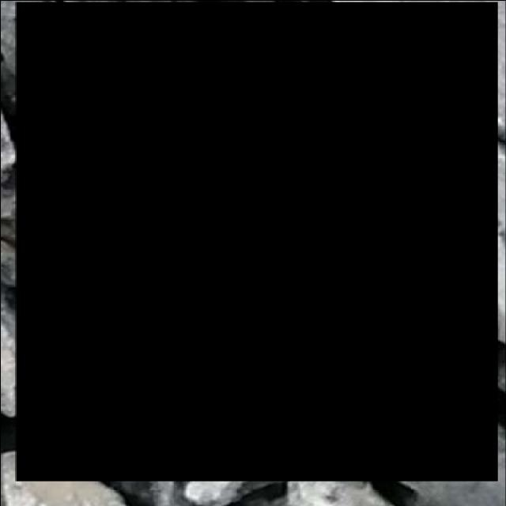

# 岩石检测检测系统源码分享
 # [一条龙教学YOLOV8标注好的数据集一键训练_70+全套改进创新点发刊_Web前端展示]

### 1.研究背景与意义

项目参考[AAAI Association for the Advancement of Artificial Intelligence](https://gitee.com/qunmasj/projects)

项目来源[AACV Association for the Advancement of Computer Vision](https://github.com/qunshansj/good)

研究背景与意义

随着地质勘探、矿产资源开发以及环境保护等领域的不断发展，岩石检测技术的重要性日益凸显。岩石作为地球表层的重要组成部分，其成分、结构和分布特征直接影响着地质灾害的预测、矿产资源的开发和生态环境的保护。因此，准确、快速地检测和识别岩石类型，尤其是在复杂的自然环境中，成为了地质学、矿业工程和环境科学等领域亟待解决的关键问题。

传统的岩石检测方法多依赖于人工观察和实验室分析，这不仅耗时耗力，而且容易受到人为因素的影响，导致结果的不准确性和不一致性。随着计算机视觉和深度学习技术的快速发展，基于图像识别的自动化岩石检测系统逐渐成为研究的热点。YOLO（You Only Look Once）系列模型以其高效的实时检测能力和较高的准确率，广泛应用于各类物体检测任务中。然而，现有的YOLO模型在特定应用场景下，尤其是在岩石检测领域，仍存在一些不足之处，如对复杂背景的适应性差、对小物体的检测能力不足等。因此，基于改进YOLOv8的岩石检测系统的研究具有重要的现实意义。

本研究所使用的数据集包含2940张岩石图像，专注于单一类别“stone”的检测。这一数据集的构建为岩石检测提供了丰富的样本支持，使得模型在训练过程中能够学习到岩石的多样性和复杂性。通过对该数据集的深入分析与处理，可以有效提升模型对岩石特征的提取能力，从而提高检测的准确性和鲁棒性。此外，数据集的规模和类别设置为模型的改进提供了良好的基础，使得研究者能够在此基础上进行针对性的优化。

在此背景下，基于改进YOLOv8的岩石检测系统不仅能够提高岩石检测的效率和准确性，还能够为地质勘探、矿产资源开发及环境监测等领域提供有力的技术支持。通过自动化的岩石检测系统，研究人员和工程师能够更快速地获取岩石信息，进而优化资源配置和环境管理，降低人力成本，提高工作效率。

综上所述，基于改进YOLOv8的岩石检测系统的研究不仅具有重要的学术价值，也具有广泛的应用前景。通过深入探讨该系统的设计与实现，能够为相关领域的研究提供新的思路和方法，推动岩石检测技术的进步，促进地质科学与工程技术的融合发展。这一研究不仅为岩石检测提供了新的技术手段，也为未来的研究奠定了坚实的基础。

### 2.图片演示







##### 注意：由于此博客编辑较早，上面“2.图片演示”和“3.视频演示”展示的系统图片或者视频可能为老版本，新版本在老版本的基础上升级如下：（实际效果以升级的新版本为准）

  （1）适配了YOLOV8的“目标检测”模型和“实例分割”模型，通过加载相应的权重（.pt）文件即可自适应加载模型。

  （2）支持“图片识别”、“视频识别”、“摄像头实时识别”三种识别模式。

  （3）支持“图片识别”、“视频识别”、“摄像头实时识别”三种识别结果保存导出，解决手动导出（容易卡顿出现爆内存）存在的问题，识别完自动保存结果并导出到tempDir中。

  （4）支持Web前端系统中的标题、背景图等自定义修改，后面提供修改教程。

  另外本项目提供训练的数据集和训练教程,暂不提供权重文件（best.pt）,需要您按照教程进行训练后实现图片演示和Web前端界面演示的效果。

### 3.视频演示

[3.1 视频演示](https://www.bilibili.com/video/BV1FwHGe2E8J/?vd_source=ff015de2d29cbe2a9cdbfa7064407a08)

### 4.数据集信息展示

数据集信息展示

在本研究中，我们利用一个专门设计的岩石检测数据集来改进YOLOv8模型的性能。该数据集名为“rock”，包含2940张高质量的图像，专注于岩石这一单一类别的物体检测。由于岩石在自然环境中的多样性和复杂性，构建一个有效的检测系统对于自动化地质勘探、环境监测以及资源管理等领域具有重要意义。

数据集中的图像均经过精心挑选，确保其在不同的光照条件、角度和背景下展现出岩石的多样性。这些图像不仅包括不同类型的岩石，还涵盖了各种自然环境，例如山地、河流边缘和沙漠等。这样的多样性使得模型在训练过程中能够学习到更为丰富的特征，从而提高其在实际应用中的泛化能力。

该数据集的唯一类别为“stone”，这意味着所有图像均围绕这一主题展开。通过专注于单一类别，我们能够深入挖掘岩石的特征，确保模型在检测过程中能够高效地识别出岩石对象。尽管类别数量有限，但每张图像都经过精细标注，确保模型能够准确学习到岩石的边界和形状特征。这种精确的标注不仅提升了模型的训练效率，也为后续的测试和验证提供了可靠的基础。

此外，该数据集的使用遵循CC BY 4.0许可证，这意味着研究人员可以自由地使用、修改和分发数据集，只需在使用时给予适当的署名。这种开放的许可协议促进了学术界和工业界的合作，鼓励更多的研究者和开发者在此基础上进行创新和改进。

为了确保数据集的可用性和有效性，我们还进行了数据预处理，包括图像的标准化和增强。这些步骤旨在提高模型的鲁棒性，使其能够在面对不同的输入条件时仍然保持良好的性能。通过数据增强技术，如随机裁剪、旋转和亮度调整，我们能够进一步扩展训练集的多样性，模拟出更多的实际应用场景。

在训练过程中，我们将利用YOLOv8的先进特性，包括其高效的特征提取和实时检测能力，结合该数据集的丰富信息，力求实现岩石检测的高准确率和高召回率。通过不断迭代和优化模型参数，我们希望能够在复杂环境中实现对岩石的快速、准确识别，从而为相关领域的研究和应用提供有力支持。

综上所述，岩石检测数据集“rock”不仅为我们提供了丰富的训练素材，还为改进YOLOv8模型提供了坚实的基础。通过充分利用该数据集的特点，我们期望能够在岩石检测领域取得显著的进展，为未来的研究和应用奠定基础。









### 5.全套项目环境部署视频教程（零基础手把手教学）

[5.1 环境部署教程链接（零基础手把手教学）](https://www.ixigua.com/7404473917358506534?logTag=c807d0cbc21c0ef59de5)


[5.2 安装Python虚拟环境创建和依赖库安装视频教程链接（零基础手把手教学）](https://www.ixigua.com/7404474678003106304?logTag=1f1041108cd1f708b01a)

### 6.手把手YOLOV8训练视频教程（零基础小白有手就能学会）

[6.1 环境部署教程链接（零基础手把手教学）](https://www.ixigua.com/7404477157818401292?logTag=d31a2dfd1983c9668658)

### 7.70+种全套YOLOV8创新点代码加载调参视频教程（一键加载写好的改进模型的配置文件）

[7.1 环境部署教程链接（零基础手把手教学）](https://www.ixigua.com/7404478314661806627?logTag=29066f8288e3f4eea3a4)

### 8.70+种全套YOLOV8创新点原理讲解（非科班也可以轻松写刊发刊，V10版本正在科研待更新）

由于篇幅限制，每个创新点的具体原理讲解就不一一展开，具体见下列网址中的创新点对应子项目的技术原理博客网址【Blog】：


[8.1 70+种全套YOLOV8创新点原理讲解链接](https://gitee.com/qunmasj/good)

### 9.系统功能展示（检测对象为举例，实际内容以本项目数据集为准）

图9.1.系统支持检测结果表格显示

  图9.2.系统支持置信度和IOU阈值手动调节

  图9.3.系统支持自定义加载权重文件best.pt(需要你通过步骤5中训练获得)

  图9.4.系统支持摄像头实时识别

  图9.5.系统支持图片识别

  图9.6.系统支持视频识别

  图9.7.系统支持识别结果文件自动保存

  图9.8.系统支持Excel导出检测结果数据


### 10.原始YOLOV8算法原理

原始YOLOv8算法原理

YOLOv8算法作为目标检测领域的最新进展，继承并发展了YOLO系列算法的优良传统，展现出更高的效率和准确性。其核心思想在于将目标检测任务转化为一个回归问题，通过一个统一的神经网络模型同时预测目标的位置和类别。YOLOv8的架构由主干网络、特征增强网络和检测头三部分组成，构建了一个高效且精确的目标检测框架。

在主干网络方面，YOLOv8延续了YOLOv5中采用的跨级结构（CSP）思想，利用C2f模块替代了YOLOv5中的C3模块。C2f模块通过引入ELAN思想，优化了特征提取过程，增加了特征流的丰富性和多样性。具体而言，C2f模块由多个CBS（卷积+归一化+SiLU激活）块和多个Bottleneck组成，形成了一个高效的特征提取网络。该模块的设计使得网络在深层模型中能够有效缓解梯度消失和梯度爆炸的问题，增强了浅层特征的重用能力，从而提升了整体检测性能。

特征增强网络采用了PAN-FPN（Path Aggregation Network - Feature Pyramid Network）结构，旨在实现多尺度特征的深度融合。通过自下而上的特征融合，YOLOv8能够充分利用不同层次的特征信息，确保在检测过程中对目标的定位和分类更加准确。PAN-FPN结构的设计允许高层特征与中层和浅层特征进行有效结合，使得模型能够更好地处理不同尺度的目标，进而提升了检测的精度和鲁棒性。

在检测头部分，YOLOv8采用了解耦头的设计，将目标分类和边界框回归分为两个独立的分支。这种解耦设计使得每个任务能够更加专注于自身的目标，避免了复杂场景下可能出现的定位不准和分类错误的问题。此外，YOLOv8引入了Anchor-free的目标检测方法，摒弃了传统的Anchor-based方法。通过直接回归目标的位置和大小，YOLOv8能够更快地聚焦于目标的实际位置，显著提高了检测速度和准确性。

在损失函数的设计上，YOLOv8采用了新的损失策略，使用VFLLoss作为分类损失，并结合DFLLoss和CIoULoss来计算边界框损失。这种新颖的损失策略使得模型在训练过程中能够更好地处理样本不平衡和困难样本的问题，提升了整体的检测效果。特别是在处理小目标时，Focal Loss的引入有效地平衡了正负样本的比例，增强了模型对难以识别目标的学习能力。

YOLOv8还在样本匹配策略上进行了创新，采用了Task-Aligned的Assigner匹配方式。这种动态匹配策略使得模型在训练过程中能够更加灵活地适应不同的目标特征，提高了样本匹配的准确性和效率。通过这种方式，YOLOv8能够在高效的基础上实现更为精确的目标检测，充分展现了其在实际应用中的潜力。

在数据预处理方面，YOLOv8借鉴了YOLOv5的策略，采用了包括马赛克增强、混合增强、空间扰动和颜色扰动等多种数据增强手段。这些增强手段不仅丰富了训练数据的多样性，还提高了模型的泛化能力，使得YOLOv8在面对复杂场景时依然能够保持高效的检测性能。

综上所述，YOLOv8算法通过对主干网络、特征增强网络和检测头的全面优化，结合创新的损失函数和样本匹配策略，展现出卓越的目标检测能力。其高效的设计使得YOLOv8不仅在训练时间和检测精度上有了显著提升，同时也使得模型的权重文件更加轻量化，能够广泛应用于各种嵌入式设备中，满足实时检测的需求。随着YOLOv8的推出，目标检测技术的应用前景将更加广阔，推动相关领域的进一步发展。


### 11.项目核心源码讲解（再也不用担心看不懂代码逻辑）

#### 11.1 ui.py

以下是经过精简和注释的核心代码部分：

```python
import sys
import subprocess
from QtFusion.path import abs_path

def run_script(script_path):
    """
    使用当前 Python 环境运行指定的脚本。

    Args:
        script_path (str): 要运行的脚本路径
    """
    # 获取当前 Python 解释器的路径
    python_path = sys.executable

    # 构建运行命令，使用 streamlit 运行指定的脚本
    command = f'"{python_path}" -m streamlit run "{script_path}"'

    # 执行命令并等待其完成
    result = subprocess.run(command, shell=True)
    
    # 检查命令执行结果，如果返回码不为0，表示出错
    if result.returncode != 0:
        print("脚本运行出错。")

# 主程序入口
if __name__ == "__main__":
    # 获取要运行的脚本的绝对路径
    script_path = abs_path("web.py")

    # 调用函数运行指定的脚本
    run_script(script_path)
```

### 代码分析与注释：
1. **导入模块**：
   - `sys`：用于访问与 Python 解释器相关的变量和函数。
   - `subprocess`：用于执行外部命令。
   - `abs_path`：从 `QtFusion.path` 模块导入的函数，用于获取文件的绝对路径。

2. **`run_script` 函数**：
   - 功能：运行指定的 Python 脚本。
   - 参数：`script_path`，要运行的脚本的路径。
   - 过程：
     - 使用 `sys.executable` 获取当前 Python 解释器的路径。
     - 构建命令字符串，使用 `streamlit` 模块运行指定的脚本。
     - 使用 `subprocess.run` 执行命令，并等待其完成。
     - 检查命令的返回码，如果不为0，则输出错误信息。

3. **主程序入口**：
   - 使用 `if __name__ == "__main__":` 确保代码只在直接运行时执行。
   - 获取要运行的脚本的绝对路径（`web.py`）。
   - 调用 `run_script` 函数来执行该脚本。 

这样，代码的核心功能得以保留，同时通过注释清晰地解释了每个部分的作用。

这个程序文件名为 `ui.py`，它的主要功能是通过当前的 Python 环境来运行一个指定的脚本。代码首先导入了必要的模块，包括 `sys`、`os` 和 `subprocess`，这些模块提供了与系统交互的功能。

在文件中定义了一个名为 `run_script` 的函数，该函数接受一个参数 `script_path`，这个参数是要运行的脚本的路径。函数内部首先获取当前 Python 解释器的路径，使用 `sys.executable` 来实现。接着，构建一个命令字符串，格式为 `"{python_path}" -m streamlit run "{script_path}"`，这个命令会调用 Streamlit 来运行指定的脚本。

随后，使用 `subprocess.run` 方法来执行这个命令。`shell=True` 参数表示在一个新的 shell 中执行命令。执行完命令后，程序会检查返回码 `result.returncode`，如果返回码不为 0，表示脚本运行过程中出现了错误，此时会打印出“脚本运行出错。”的提示信息。

在文件的最后部分，使用 `if __name__ == "__main__":` 来判断当前模块是否是主程序，如果是，则会指定要运行的脚本路径，这里使用了 `abs_path("web.py")` 来获取 `web.py` 的绝对路径。最后，调用 `run_script` 函数来运行这个脚本。

总体来说，这个文件的功能是封装了一个简单的接口，用于启动一个 Streamlit 应用程序，便于开发者在当前 Python 环境中快速运行指定的 Web 脚本。

#### 11.2 ultralytics\utils\torch_utils.py

以下是经过简化和注释的核心代码部分，主要保留了与模型选择、设备管理、模型信息获取等相关的功能：

```python
import os
import platform
import torch
import torch.nn as nn
import torchvision
from contextlib import contextmanager
from pathlib import Path

# 检查 PyTorch 和 torchvision 的版本
TORCH_1_9 = torch.__version__ >= "1.9.0"
TORCH_2_0 = torch.__version__ >= "2.0.0"
TORCHVISION_0_10 = torchvision.__version__ >= "0.10.0"

@contextmanager
def torch_distributed_zero_first(local_rank: int):
    """在分布式训练中，确保所有进程在 local_master 完成某些操作之前等待。"""
    initialized = torch.distributed.is_available() and torch.distributed.is_initialized()
    if initialized and local_rank not in (-1, 0):
        torch.distributed.barrier(device_ids=[local_rank])  # 同步其他进程
    yield
    if initialized and local_rank == 0:
        torch.distributed.barrier(device_ids=[0])  # local_master 完成后，其他进程继续

def select_device(device="", batch=0, verbose=True):
    """
    根据提供的参数选择合适的 PyTorch 设备。
    
    参数:
        device (str | torch.device): 设备字符串或 torch.device 对象，默认为空字符串。
        batch (int): 模型使用的批量大小，默认为 0。
        verbose (bool): 如果为 True，则记录设备信息，默认为 True。

    返回:
        torch.device: 选择的设备。
    """
    if isinstance(device, torch.device):
        return device

    device = str(device).lower().strip()  # 转为小写并去除空格
    if device in ["cpu", "none"]:
        os.environ["CUDA_VISIBLE_DEVICES"] = "-1"  # 强制使用 CPU
        return torch.device("cpu")

    # 处理 CUDA 设备
    if device.startswith("cuda"):
        device = device.replace("cuda:", "")
    visible = os.environ.get("CUDA_VISIBLE_DEVICES", None)
    os.environ["CUDA_VISIBLE_DEVICES"] = device  # 设置环境变量

    if not (torch.cuda.is_available() and torch.cuda.device_count() >= len(device.split(","))):
        raise ValueError(f"无效的 CUDA 设备 '{device}' 请求。")

    # 选择 GPU 设备
    devices = device.split(",") if device else "0"
    arg = "cuda:0" if devices else "cpu"

    if verbose:
        print(f"选择的设备: {arg}")
    return torch.device(arg)

def model_info(model, detailed=False, verbose=True):
    """
    获取模型信息，包括参数数量和层数。

    参数:
        model: 要获取信息的模型。
        detailed (bool): 是否详细显示每层信息，默认为 False。
        verbose (bool): 是否打印信息，默认为 True。

    返回:
        (int, int): 返回层数和参数数量。
    """
    if not verbose:
        return
    n_p = sum(p.numel() for p in model.parameters())  # 计算参数总数
    n_l = len(list(model.modules()))  # 计算层数

    if detailed:
        print(f"模型层数: {n_l}, 参数数量: {n_p}")

    return n_l, n_p

# 示例：选择设备并获取模型信息
device = select_device('cuda:0')  # 选择 CUDA 设备
model = nn.Sequential(nn.Conv2d(3, 16, 3), nn.ReLU())  # 创建一个简单的模型
model_info(model, detailed=True)  # 获取模型信息
```

### 代码注释说明
1. **torch_distributed_zero_first**: 这是一个上下文管理器，用于在分布式训练中确保所有进程在某个进程完成特定操作之前等待。
2. **select_device**: 该函数根据用户输入选择合适的设备（CPU 或 GPU），并检查设备的可用性。
3. **model_info**: 该函数用于获取模型的层数和参数数量，并可选择是否详细打印每层的信息。

以上代码片段展示了如何选择设备和获取模型信息的基本功能，并附有详细的中文注释。

这个程序文件是Ultralytics YOLO框架中的一个工具模块，主要用于处理与PyTorch相关的功能和操作。代码中包含了多个函数和类，旨在简化模型训练、推理和性能分析的过程。

首先，文件导入了一些必要的库，包括标准库和PyTorch相关的库。它检查了当前使用的PyTorch和TorchVision的版本，以确保兼容性。接着，定义了一些上下文管理器和装饰器，比如`torch_distributed_zero_first`，用于在分布式训练中协调各个进程的执行顺序，以及`smart_inference_mode`，根据PyTorch的版本选择合适的推理模式。

文件中还包含了获取CPU信息的函数`get_cpu_info`，以及选择设备的函数`select_device`，该函数可以根据用户的输入选择合适的计算设备（CPU或GPU），并检查设备的可用性和数量。此外，`time_sync`函数用于在GPU可用时同步CUDA操作，以确保时间测量的准确性。

在模型处理方面，文件提供了`fuse_conv_and_bn`和`fuse_deconv_and_bn`函数，用于将卷积层和批归一化层融合，以提高推理效率。`model_info`函数则用于输出模型的基本信息，包括参数数量、层数和计算复杂度（FLOPs）。

为了便于模型训练，文件中还定义了`initialize_weights`函数，用于初始化模型的权重，以及`EarlyStopping`类，用于在训练过程中监控模型的性能，并在没有改进时提前停止训练。

此外，文件中还实现了一些用于性能分析的函数，比如`get_flops`和`profile`，用于计算模型的FLOPs和内存使用情况。这些函数可以帮助用户评估模型的效率，并进行相应的优化。

最后，文件还包含了一些辅助函数，如`strip_optimizer`，用于从训练好的模型中去除优化器信息，以便于模型的保存和部署。

总的来说，这个文件提供了一系列工具函数和类，旨在支持YOLO模型的训练、推理和性能分析，帮助用户更高效地使用PyTorch进行深度学习任务。

#### 11.3 ultralytics\models\fastsam\prompt.py

以下是代码中最核心的部分，并附上详细的中文注释：

```python
import os
import numpy as np
import torch
from PIL import Image
import cv2
from ultralytics.utils import TQDM

class FastSAMPrompt:
    """
    Fast Segment Anything Model 类，用于图像注释和可视化。

    属性:
        device (str): 计算设备（'cuda' 或 'cpu'）。
        results: 目标检测或分割结果。
        source: 源图像或图像路径。
        clip: 用于线性分配的 CLIP 模型。
    """

    def __init__(self, source, results, device="cuda") -> None:
        """初始化 FastSAMPrompt，设置源图像、结果和设备，并导入 CLIP 模型。"""
        self.device = device
        self.results = results
        self.source = source

        # 导入并分配 CLIP 模型
        try:
            import clip  # 用于线性分配
        except ImportError:
            from ultralytics.utils.checks import check_requirements
            check_requirements("git+https://github.com/openai/CLIP.git")
            import clip
        self.clip = clip

    @staticmethod
    def _format_results(result, filter=0):
        """将检测结果格式化为包含 ID、分割、边界框、得分和面积的注释列表。"""
        annotations = []
        n = len(result.masks.data) if result.masks is not None else 0
        for i in range(n):
            mask = result.masks.data[i] == 1.0
            if torch.sum(mask) >= filter:
                annotation = {
                    "id": i,
                    "segmentation": mask.cpu().numpy(),
                    "bbox": result.boxes.data[i],
                    "score": result.boxes.conf[i],
                }
                annotation["area"] = annotation["segmentation"].sum()
                annotations.append(annotation)
        return annotations

    @staticmethod
    def _get_bbox_from_mask(mask):
        """从掩码中获取边界框，应用形态学变换并返回边界框坐标。"""
        mask = mask.astype(np.uint8)
        contours, _ = cv2.findContours(mask, cv2.RETR_EXTERNAL, cv2.CHAIN_APPROX_SIMPLE)
        x1, y1, w, h = cv2.boundingRect(contours[0])
        x2, y2 = x1 + w, y1 + h
        if len(contours) > 1:
            for b in contours:
                x_t, y_t, w_t, h_t = cv2.boundingRect(b)
                x1 = min(x1, x_t)
                y1 = min(y1, y_t)
                x2 = max(x2, x_t + w_t)
                y2 = max(y2, y_t + h_t)
        return [x1, y1, x2, y2]

    def plot(self, annotations, output):
        """
        在图像上绘制注释、边界框和点，并保存输出。

        参数:
            annotations (list): 要绘制的注释。
            output (str or Path): 保存绘图的输出目录。
        """
        pbar = TQDM(annotations, total=len(annotations))
        for ann in pbar:
            result_name = os.path.basename(ann.path)
            image = ann.orig_img[..., ::-1]  # BGR 转 RGB
            plt.figure(figsize=(image.shape[1] / 100, image.shape[0] / 100))
            plt.imshow(image)

            if ann.masks is not None:
                masks = ann.masks.data
                for i, mask in enumerate(masks):
                    mask = mask.astype(np.uint8)
                    plt.imshow(mask, alpha=0.5)  # 显示掩码

            # 保存图像
            save_path = os.path.join(output, result_name)
            plt.axis("off")
            plt.savefig(save_path, bbox_inches="tight", pad_inches=0, transparent=True)
            plt.close()
            pbar.set_description(f"Saving {result_name} to {save_path}")

    @torch.no_grad()
    def retrieve(self, model, preprocess, elements, search_text: str, device) -> int:
        """处理图像和文本，计算相似度并返回 softmax 分数。"""
        preprocessed_images = [preprocess(image).to(device) for image in elements]
        tokenized_text = self.clip.tokenize([search_text]).to(device)
        stacked_images = torch.stack(preprocessed_images)
        image_features = model.encode_image(stacked_images)
        text_features = model.encode_text(tokenized_text)
        image_features /= image_features.norm(dim=-1, keepdim=True)
        text_features /= text_features.norm(dim=-1, keepdim=True)
        probs = 100.0 * image_features @ text_features.T
        return probs[:, 0].softmax(dim=0)

    def everything_prompt(self):
        """返回类中处理的结果。"""
        return self.results
```

### 代码核心部分说明：
1. **类定义与初始化**：`FastSAMPrompt` 类用于处理图像分割和注释，初始化时接收源图像、结果和计算设备，并导入 CLIP 模型。
2. **结果格式化**：`_format_results` 方法将检测结果格式化为注释列表，包含 ID、分割掩码、边界框、得分和面积。
3. **边界框提取**：`_get_bbox_from_mask` 方法从分割掩码中提取边界框，支持多个轮廓的处理。
4. **绘图功能**：`plot` 方法在图像上绘制分割掩码和注释，并将结果保存到指定路径。
5. **检索功能**：`retrieve` 方法处理图像和文本，计算相似度并返回 softmax 分数。
6. **结果获取**：`everything_prompt` 方法返回处理后的结果。

这些部分是实现图像分割和注释的核心功能，确保了模型的有效性和可视化效果。

这个程序文件是一个用于图像注释和可视化的类，名为 `FastSAMPrompt`，它是基于 Ultralytics YOLO 和 CLIP 模型构建的。该类的主要功能是处理图像的分割和标注，并将结果可视化。类的构造函数接受源图像、检测结果和计算设备（如 CPU 或 GPU）作为参数，并尝试导入 CLIP 模型用于线性分配。

类中定义了一些静态方法和实例方法。静态方法包括 `_segment_image`、`_format_results`、`_get_bbox_from_mask` 等，用于处理图像分割、格式化检测结果和从掩膜中获取边界框。这些方法通过操作 NumPy 数组和 OpenCV 函数来实现图像的处理和分析。

`plot` 方法用于在图像上绘制注释、边界框和点，并将结果保存到指定的输出目录。它使用 Matplotlib 库进行可视化，支持多种参数选项，如是否使用随机颜色、是否应用形态学变换以提高掩膜质量等。

`fast_show_mask` 方法用于快速显示掩膜注释，支持不同的颜色和透明度设置。它会根据提供的边界框和点的标签在图像上绘制矩形和散点。

类中还实现了一些用于处理用户输入的提示方法，包括 `box_prompt`、`point_prompt` 和 `text_prompt`。这些方法根据用户提供的边界框、点或文本提示来调整掩膜，并返回更新后的结果。

最后，`everything_prompt` 方法用于返回处理后的结果，方便用户获取最终的输出。整体而言，这个类提供了一整套用于图像分割和注释的工具，结合了深度学习模型的强大能力，能够实现高效的图像处理和可视化。

#### 11.4 ultralytics\models\rtdetr\predict.py

以下是经过简化和注释的核心代码部分：

```python
import torch
from ultralytics.data.augment import LetterBox
from ultralytics.engine.predictor import BasePredictor
from ultralytics.engine.results import Results
from ultralytics.utils import ops

class RTDETRPredictor(BasePredictor):
    """
    RT-DETR (Real-Time Detection Transformer) 预测器，继承自 BasePredictor 类，用于使用百度的 RT-DETR 模型进行预测。
    该类利用视觉变换器的强大功能，提供实时物体检测，同时保持高精度。
    """

    def postprocess(self, preds, img, orig_imgs):
        """
        对模型的原始预测结果进行后处理，生成边界框和置信度分数。

        参数:
            preds (torch.Tensor): 模型的原始预测结果。
            img (torch.Tensor): 处理后的输入图像。
            orig_imgs (list or torch.Tensor): 原始未处理的图像。

        返回:
            (list[Results]): 包含后处理后的边界框、置信度分数和类别标签的 Results 对象列表。
        """
        # 获取预测结果的维度
        nd = preds[0].shape[-1]
        # 分离边界框和分数
        bboxes, scores = preds[0].split((4, nd - 4), dim=-1)

        # 如果输入图像不是列表，则转换为numpy数组
        if not isinstance(orig_imgs, list):
            orig_imgs = ops.convert_torch2numpy_batch(orig_imgs)

        results = []
        for i, bbox in enumerate(bboxes):  # 遍历每个边界框
            bbox = ops.xywh2xyxy(bbox)  # 将边界框格式从xywh转换为xyxy
            score, cls = scores[i].max(-1, keepdim=True)  # 获取每个边界框的最大分数和对应类别
            idx = score.squeeze(-1) > self.args.conf  # 根据置信度阈值筛选边界框
            if self.args.classes is not None:
                # 如果指定了类别，则进一步筛选
                idx = (cls == torch.tensor(self.args.classes, device=cls.device)).any(1) & idx
            # 根据筛选条件过滤边界框、分数和类别
            pred = torch.cat([bbox, score, cls], dim=-1)[idx]
            orig_img = orig_imgs[i]  # 获取原始图像
            oh, ow = orig_img.shape[:2]  # 获取原始图像的高度和宽度
            pred[..., [0, 2]] *= ow  # 将边界框坐标转换为原始图像坐标
            pred[..., [1, 3]] *= oh
            img_path = self.batch[0][i]  # 获取图像路径
            # 将结果添加到列表中
            results.append(Results(orig_img, path=img_path, names=self.model.names, boxes=pred))
        return results

    def pre_transform(self, im):
        """
        在将输入图像送入模型进行推理之前，对其进行预处理。输入图像被调整为方形比例并填充。

        参数:
            im (list[np.ndarray] | torch.Tensor): 输入图像，形状为 (N,3,h,w) 的张量，或 [(h,w,3) x N] 的列表。

        返回:
            (list): 预处理后的图像列表，准备进行模型推理。
        """
        letterbox = LetterBox(self.imgsz, auto=False, scaleFill=True)  # 创建 LetterBox 对象
        return [letterbox(image=x) for x in im]  # 对每个图像进行预处理
```

### 代码说明：
1. **导入必要的库**：导入了 PyTorch 和其他相关模块。
2. **RTDETRPredictor 类**：继承自 `BasePredictor`，用于实现 RT-DETR 模型的预测功能。
3. **postprocess 方法**：对模型的原始预测结果进行后处理，生成最终的边界框、置信度和类别标签。
   - 将预测结果分为边界框和分数。
   - 根据置信度和类别进行筛选。
   - 将边界框坐标转换为原始图像的坐标。
4. **pre_transform 方法**：对输入图像进行预处理，确保其为方形并进行适当的缩放，以便于模型进行推理。

这个程序文件 `ultralytics\models\rtdetr\predict.py` 定义了一个名为 `RTDETRPredictor` 的类，继承自 `BasePredictor`，用于使用百度的 RT-DETR 模型进行实时目标检测。该类利用视觉变换器的强大能力，在保持高精度的同时提供实时的物体检测功能。它支持高效的混合编码和 IoU 感知查询选择等关键特性。

在文件的开头，导入了一些必要的库和模块，包括 `torch` 和一些来自 `ultralytics` 的工具和功能模块。接下来，类的文档字符串详细描述了其功能和用法，给出了一个使用示例，展示了如何创建 `RTDETRPredictor` 的实例并调用其 `predict_cli` 方法进行预测。

该类有两个主要的方法：`postprocess` 和 `pre_transform`。

`postprocess` 方法负责对模型的原始预测结果进行后处理，以生成边界框和置信度分数。它首先将预测结果分割为边界框和分数，然后根据置信度和类别进行过滤。处理过程中，如果输入图像不是列表格式，则将其转换为 NumPy 格式。接着，对于每个边界框，计算最大分数和对应的类别，并根据设定的置信度阈值和类别进行筛选。最后，将筛选后的结果与原始图像结合，生成包含边界框、置信度和类别标签的 `Results` 对象列表。

`pre_transform` 方法用于在将输入图像传递给模型进行推理之前对其进行预处理。它使用 `LetterBox` 类将输入图像调整为方形并进行缩放，以确保输入图像的长宽比为1:1。该方法接受一个图像列表或张量，并返回经过预处理的图像列表，准备好进行模型推理。

总体而言，这个文件实现了一个高效的目标检测预测器，能够处理输入图像并输出经过后处理的检测结果，适用于实时应用场景。

#### 11.5 ultralytics\models\nas\predict.py

以下是代码中最核心的部分，并附上详细的中文注释：

```python
import torch
from ultralytics.engine.predictor import BasePredictor
from ultralytics.engine.results import Results
from ultralytics.utils import ops

class NASPredictor(BasePredictor):
    """
    Ultralytics YOLO NAS 预测器，用于目标检测。

    该类扩展了 Ultralytics 引擎中的 `BasePredictor`，负责对 YOLO NAS 模型生成的原始预测结果进行后处理。
    它应用了非极大值抑制（NMS）和缩放边界框以适应原始图像尺寸等操作。

    属性:
        args (Namespace): 包含各种后处理配置的命名空间。
    """

    def postprocess(self, preds_in, img, orig_imgs):
        """对预测结果进行后处理，并返回结果对象的列表。"""

        # 将预测框转换为 (x_center, y_center, width, height) 格式
        boxes = ops.xyxy2xywh(preds_in[0][0])
        # 将边界框和类分数合并，并调整维度
        preds = torch.cat((boxes, preds_in[0][1]), -1).permute(0, 2, 1)

        # 应用非极大值抑制，过滤冗余的检测框
        preds = ops.non_max_suppression(
            preds,
            self.args.conf,  # 置信度阈值
            self.args.iou,   # IOU 阈值
            agnostic=self.args.agnostic_nms,  # 是否对类别无关
            max_det=self.args.max_det,  # 最大检测框数量
            classes=self.args.classes,   # 指定的类别
        )

        # 如果输入图像不是列表，则将其转换为 numpy 数组
        if not isinstance(orig_imgs, list):
            orig_imgs = ops.convert_torch2numpy_batch(orig_imgs)

        results = []
        # 遍历每个预测结果
        for i, pred in enumerate(preds):
            orig_img = orig_imgs[i]  # 获取原始图像
            # 将预测框缩放到原始图像的尺寸
            pred[:, :4] = ops.scale_boxes(img.shape[2:], pred[:, :4], orig_img.shape)
            img_path = self.batch[0][i]  # 获取图像路径
            # 创建结果对象并添加到结果列表中
            results.append(Results(orig_img, path=img_path, names=self.model.names, boxes=pred))
        return results  # 返回处理后的结果列表
```

### 代码说明：
1. **导入必要的库**：导入 `torch` 和其他 Ultralytics 模块，提供模型预测和结果处理的功能。
2. **NASPredictor 类**：继承自 `BasePredictor`，用于 YOLO NAS 模型的预测后处理。
3. **postprocess 方法**：核心方法，负责将模型的原始预测结果进行后处理，包括：
   - 将预测框格式转换为 `(x_center, y_center, width, height)`。
   - 合并边界框和类分数，并调整张量的维度。
   - 应用非极大值抑制（NMS）来去除冗余的检测框。
   - 将输入图像转换为 numpy 数组（如果需要）。
   - 遍历每个预测结果，缩放边界框到原始图像的尺寸，并创建结果对象。
4. **返回结果**：最终返回一个包含所有处理后结果的列表。

该程序文件 `ultralytics\models\nas\predict.py` 是 Ultralytics YOLO NAS 模型的预测模块，主要用于对象检测。文件中定义了一个名为 `NASPredictor` 的类，该类继承自 `BasePredictor`，负责对 YOLO NAS 模型生成的原始预测结果进行后处理。

在这个类中，主要的功能是对模型的输出进行处理，包括应用非极大值抑制（NMS）和将边界框的坐标缩放到原始图像的尺寸。该类的属性 `args` 是一个命名空间，包含了后处理所需的各种配置参数。

`NASPredictor` 类的使用示例展示了如何从 `NAS` 类中获取预测器，并使用 `postprocess` 方法对原始预测结果进行处理。通常情况下，这个类不会被直接实例化，而是作为 `NAS` 类的内部组件使用。

在 `postprocess` 方法中，首先将输入的预测结果进行转换，提取出边界框和类分数。接着，调用 `non_max_suppression` 函数进行非极大值抑制，以过滤掉重叠的检测框。然后，检查输入的原始图像是否为列表，如果不是，则将其转换为 NumPy 格式。最后，循环遍历每个预测结果，将边界框的坐标缩放到原始图像的尺寸，并将结果存储在 `Results` 对象中，最终返回这些结果。

整体来看，该文件实现了 YOLO NAS 模型的预测后处理功能，为用户提供了处理和获取检测结果的接口。

#### 11.6 train.py

以下是经过简化和注释的核心代码部分：

```python
import os
import torch
import yaml
from ultralytics import YOLO  # 导入YOLO模型库
from QtFusion.path import abs_path  # 导入路径处理工具

# 设置设备为GPU（如果可用），否则使用CPU
device = "0" if torch.cuda.is_available() else "cpu"

if __name__ == '__main__':  # 确保该模块被直接运行时才执行以下代码
    workers = 1  # 设置数据加载的工作进程数
    batch = 2    # 设置每个批次的大小

    data_name = "data"  # 数据集名称
    # 获取数据集配置文件的绝对路径
    data_path = abs_path(f'datasets/{data_name}/{data_name}.yaml', path_type='current')  
    unix_style_path = data_path.replace(os.sep, '/')  # 将路径转换为Unix风格

    # 获取数据集目录路径
    directory_path = os.path.dirname(unix_style_path)
    
    # 读取YAML配置文件
    with open(data_path, 'r') as file:
        data = yaml.load(file, Loader=yaml.FullLoader)
    
    # 如果YAML文件中包含'path'项，则修改为当前目录路径
    if 'path' in data:
        data['path'] = directory_path
        # 将修改后的数据写回YAML文件
        with open(data_path, 'w') as file:
            yaml.safe_dump(data, file, sort_keys=False)

    # 加载YOLOv8模型配置
    model = YOLO(model='./ultralytics/cfg/models/v8/yolov8s.yaml', task='detect')  
    
    # 开始训练模型
    results2 = model.train(
        data=data_path,  # 指定训练数据的配置文件路径
        device=device,  # 使用指定的设备进行训练
        workers=workers,  # 使用的工作进程数
        imgsz=640,  # 输入图像的大小为640x640
        epochs=100,  # 训练100个epoch
        batch=batch,  # 每个批次的大小
        name='train_v8_' + data_name  # 训练任务的名称
    )
```

### 代码注释说明：
1. **导入库**：导入必要的库，包括操作系统、PyTorch、YAML处理库和YOLO模型库。
2. **设备选择**：根据是否有可用的GPU选择设备，确保训练过程的高效性。
3. **主程序入口**：使用`if __name__ == '__main__':`确保代码只在直接运行时执行。
4. **参数设置**：定义数据加载的工作进程数和批次大小。
5. **数据集路径处理**：构建数据集配置文件的绝对路径，并转换为Unix风格的路径。
6. **读取和修改YAML文件**：读取数据集的YAML配置文件，修改其中的路径项，并将其写回文件。
7. **模型加载**：加载YOLOv8模型的配置文件，准备进行训练。
8. **模型训练**：调用模型的训练方法，传入必要的参数，如数据路径、设备、工作进程数、图像大小、训练轮数和批次大小等。

这个程序文件`train.py`主要用于训练YOLOv8目标检测模型。首先，程序导入了必要的库，包括`os`、`torch`、`yaml`和`ultralytics`中的YOLO模型。接着，程序检查是否有可用的GPU，如果有，则将设备设置为"0"（表示使用第一个GPU），否则使用CPU。

在`__main__`模块中，程序设置了一些训练参数，包括工作进程数量和批次大小。接下来，程序定义了数据集的名称，并构建了数据集配置文件的绝对路径。这里使用了`abs_path`函数来获取路径，并将路径中的分隔符统一为Unix风格。

程序随后获取了数据集目录的路径，并打开指定的YAML文件以读取数据集配置。读取后，程序检查配置中是否包含`path`项，如果有，则将其修改为数据集的目录路径，并将更新后的内容写回到YAML文件中，以确保后续的训练能够正确找到数据集。

接下来，程序加载了YOLOv8的预训练模型，指定了模型的配置文件。之后，调用`model.train`方法开始训练模型。在训练过程中，程序指定了训练数据的配置文件路径、设备、工作进程数量、输入图像的大小（640x640）、训练的轮数（100个epoch）、每个批次的大小（2），以及训练任务的名称。

整体来看，这段代码的主要功能是准备数据集并配置YOLOv8模型的训练过程，确保模型能够正确读取数据并进行训练。

### 12.系统整体结构（节选）

### 整体功能和构架概括

该项目是一个基于Ultralytics YOLO系列模型的目标检测框架，包含多个模块和工具，旨在提供高效的目标检测、训练和推理功能。项目的整体架构分为几个主要部分：

1. **用户界面（UI）**：通过 `ui.py` 提供了一个简单的接口，用于启动和运行Streamlit应用，便于用户进行模型的可视化和交互。

2. **工具函数**：在 `ultralytics/utils/torch_utils.py` 中提供了一系列与PyTorch相关的工具函数，支持模型的训练、推理和性能分析。

3. **模型预测**：多个预测模块（如 `ultralytics/models/fastsam/prompt.py`、`ultralytics/models/rtdetr/predict.py` 和 `ultralytics/models/nas/predict.py`）实现了不同模型的预测功能，处理输入图像并返回检测结果。

4. **训练模块**：`train.py` 负责模型的训练过程，配置数据集和训练参数，并调用相应的模型进行训练。

5. **解决方案和应用**：在 `ultralytics/solutions` 目录下，可能包含特定应用场景的实现，如速度估计和AI训练环境等。

6. **回调和错误处理**：在 `ultralytics/utils/callbacks/base.py` 和 `ultralytics/utils/errors.py` 中，提供了训练过程中的回调函数和错误处理机制，以提高训练的灵活性和鲁棒性。

### 文件功能整理表

| 文件路径                                           | 功能描述                                                                                     |
|--------------------------------------------------|---------------------------------------------------------------------------------------------|
| `ui.py`                                         | 提供一个简单的用户界面，通过Streamlit运行指定的脚本，便于可视化和交互。                     |
| `ultralytics/utils/torch_utils.py`             | 提供与PyTorch相关的工具函数，支持模型训练、推理和性能分析。                               |
| `ultralytics/models/fastsam/prompt.py`         | 实现FastSAM模型的图像分割和注释功能，支持用户输入的提示处理和结果可视化。                 |
| `ultralytics/models/rtdetr/predict.py`         | 实现RT-DETR模型的预测功能，处理输入图像并返回经过后处理的检测结果。                       |
| `ultralytics/models/nas/predict.py`            | 实现YOLO NAS模型的预测功能，处理模型输出并进行非极大值抑制。                             |
| `train.py`                                     | 负责模型的训练过程，配置数据集和训练参数，并调用YOLOv8模型进行训练。                     |
| `ultralytics/solutions/speed_estimation.py`    | 实现与速度估计相关的功能，可能用于特定的应用场景。                                       |
| `ultralytics/solutions/ai_gym.py`              | 提供AI训练环境的实现，可能用于训练和测试模型的特定应用。                                 |
| `ultralytics/utils/callbacks/base.py`          | 提供训练过程中的回调函数，支持灵活的训练过程控制。                                       |
| `ultralytics/utils/errors.py`                  | 提供错误处理机制，增强训练和推理过程的鲁棒性。                                           |

以上表格总结了项目中各个文件的功能，帮助理解整个框架的结构和用途。

注意：由于此博客编辑较早，上面“11.项目核心源码讲解（再也不用担心看不懂代码逻辑）”中部分代码可能会优化升级，仅供参考学习，完整“训练源码”、“Web前端界面”和“70+种创新点源码”以“13.完整训练+Web前端界面+70+种创新点源码、数据集获取”的内容为准。

### 13.完整训练+Web前端界面+70+种创新点源码、数据集获取


https://mbd.pub/o/bread/ZpqXl59x